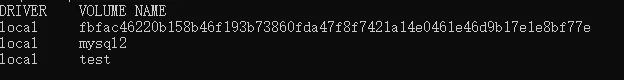
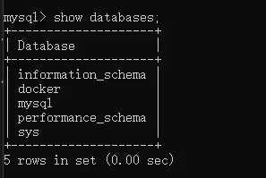
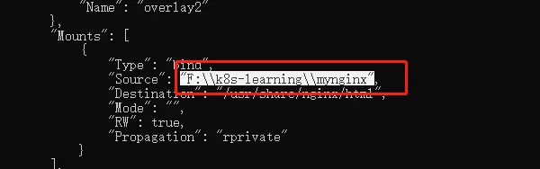

Docker 数据持久化核心通过==数据卷（Volume） 和本地目录挂载==实现，解决容器销毁后`数据丢失问题`，以下是分类整理的基础命令和实操示例。

## 数据卷（Volume）基本命令

数据卷是 Docker 官方推荐的持久化方式，由 Docker 统一管理，支持跨容器共享，可手动指定名称实现数据固定持久化。

``` bash
# 1. 查看所有已创建的数据卷
docker volume ls

# 2. 删除指定名称的数据卷（示例：删除mysql2数据卷）
docker volume rm mysql2

# 3. 删除所有未被容器使用的闲置数据卷（谨慎操作，不可逆）
docker volume prune

# 4. 查看指定数据卷的详细信息（路径、驱动等，示例：查看mysql2）
docker volume inspect mysql2
```

## 数据卷实操 - 创建 MySQL 持久化容器

**核心说明**

- 不加 `-v` 参数：Docker 会自动生成`随机命名`的数据卷，每次`创建容器生成新卷`，数据无法持久化共享
- 加 `-v 卷名:容器内路径`：Docker 会生成`固定名称`的数据卷，即使容器`删除重建`，`数据卷仍存在`，数据持久化保留

``` bash
# 创建MySQL5.7容器，指定固定数据卷mysql2实现数据持久化
# 参数说明：
# -d 后台运行 | --name 容器名 | -e 配置环境变量（空密码） | -p 端口映射 | -v 数据卷挂载
docker run -d --name mysql2 \
-e MYSQL_ALLOW_EMPTY_PASSWORD=true \
-p 3309:3306 \
-v mysql2:/var/lib/mysql \
mysql:5.7
```

::: tip
特性：删除该 mysql2 容器后，重新执行上述命令创建同名容器，数据卷 mysql2 不会被删除，数据库数据完全保留。
:::

**数据卷列表**



**删除容器重新创建，docker数据库内容没变**




## 本地目录挂载

直接将`宿主机本地目录 / 文件`映射到容器内指定路径，数据直接存储在宿主机，可直接在宿主机修改文件，适合需要手动操作容器内文件的场景（如 Nginx 静态页面、配置文件）。

**核心特性**

- 宿主机与容器目录**双向同步**，宿主机修改文件容器内实时生效
- 容器销毁后，宿主机目录数据仍存在，重建容器挂载同一路径即可恢复数据

``` bash
# 示例1：Nginx容器挂载宿主机本地目录（静态页面目录）
# 格式：-v 宿主机本地绝对路径:容器内目标路径
docker run -d --name nginx4 \
-p 8084:80 \
-v F:\k8s-learning\mynginx:/usr/share/nginx/html \
nginx:v4

# 示例2：通用格式（适配Linux/Mac，路径为/开头的绝对路径）
# docker run -d --name 容器名 -p 宿主机端口:容器端口 -v /宿主机绝对路径:/容器内路径 镜像名:版本
```

