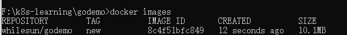
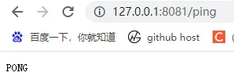

## 分步构建（先编译再部署，手动拷贝二进制）

适用于需要单独获取编译后二进制文件、分阶段管控构建 / 部署流程的场景，分「Golang 环境编译」和「scratch 空镜像运行」两步执行。

### Golang 环境编译镜像（生成二进制文件）

**编译阶段 Dockerfile**

``` dockerfile
# 基础镜像：Golang 1.19 官方编译环境
FROM golang:1.19

# 设置工作目录
WORKDIR /usr/src/app

# 复制项目所有代码到容器编译目录
ADD . /usr/src/app/

# 配置国内GOPROXY加速依赖下载，整理依赖并编译为Linux可执行二进制
RUN go env -w GOPROXY=https://goproxy.cn,direct \
    && go mod tidy \
    && go env -w CGO_ENABLED=0 \
    && GOOS=linux GOARCH=amd64 go build -v -o /usr/src/app/app-server
```

**编译阶段操作命令**

``` bash
# 构建编译镜像（打标签 whilesun/godemo:build）
docker build -t whilesun/godemo:build .

# 创建临时容器（用于拷贝二进制文件，不启动）
docker create --name prebuild whilesun/godemo:build

# 从临时容器拷贝编译好的二进制文件到宿主机当前目录
docker cp prebuild:/usr/src/app/app-server ./app-server
```

### scratch 空镜像运行（轻量部署）

**运行阶段 Dockerfile**

``` dockerfile
# 基础镜像：scratch 空镜像（无任何系统依赖，极致轻量）
FROM scratch

# 拷贝宿主机上的Go二进制文件到容器根目录
COPY ./app-server .

# 暴露服务端口（根据实际服务端口调整）
EXPOSE 8080

# 启动Go服务
CMD ["./app-server"]
```

**运行阶段操作命令**

``` bash
# 构建运行镜像（--no-cache 忽略缓存，强制重新构建，打标签 whilesun/godemo:old）
docker build --no-cache -t whilesun/godemo:old .

# 启动容器（交互式+端口映射 宿主机8080:容器8080）
docker run -it -p 8080:8080 whilesun/godemo:old

# 访问服务（宿主机访问，根据实际接口调整）
curl http://localhost:8080
```

## 单文件多阶段构建(一步完成编译 + 部署)

使用 Docker **多阶段构建** 特性，一个 Dockerfile 完成「Golang 编译」和「scratch 运行」，无需手动拷贝二进制，流程更简洁、易维护，生产环境首选。

**多阶段构建 Dockerfile（命名：Dockerfile.new）**

``` dockerfile
# 阶段1：编译阶段（命名为 build-env，后续阶段可引用）
FROM golang:1.19 AS build-env

# 编译工作目录
WORKDIR /usr/src/app

# 复制项目代码到编译目录
ADD . /usr/src/app/

# 配置国内代理+关闭CGO+编译为Linux amd64架构二进制
RUN go env -w GOPROXY=https://goproxy.cn,direct \
    && go mod tidy \
    && go env -w CGO_ENABLED=0 \
    && GOOS=linux GOARCH=amd64 go build -v -o /usr/src/app/app-server

# 阶段2：运行阶段（基于scratch空镜像，仅保留二进制文件）
FROM scratch

# 从编译阶段（build-env）拷贝二进制文件到当前镜像根目录
COPY --from=build-env /usr/src/app/app-server .

# 声明服务监听端口
EXPOSE 8080

# 启动Go服务
CMD ["./app-server"]
```

**多阶段构建操作命令**

``` bash
# 构建运行镜像（指定自定义Dockerfile为Dockerfile.new，打标签 whilesun/godemo:new）
docker build -t whilesun/godemo:new . -f Dockerfile.new

# 启动容器（端口映射 宿主机8081:容器8080，可根据需求调整宿主机端口）
docker run -it -p 8081:8080 whilesun/godemo:new

# 访问服务（宿主机访问，对应上面的端口映射）
curl http://localhost:8081
```

**多阶段构建镜像大小**



**多阶段构建后访问**



## Go 项目 Docker 构建忽略文件（.dockerignore）

创建 `.dockerignore` 文件放在项目根目录，忽略无需参与构建的文件 / 目录，**减少构建上下文大小、提升构建速度、避免不必要的文件拷贝**，是 Go 项目 Docker 构建的最佳实践。

