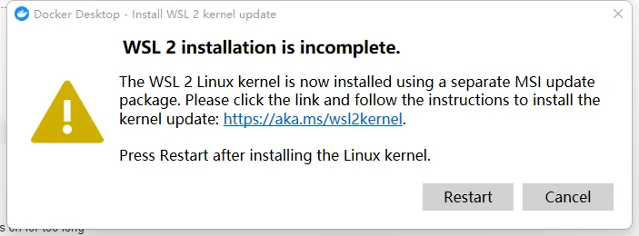
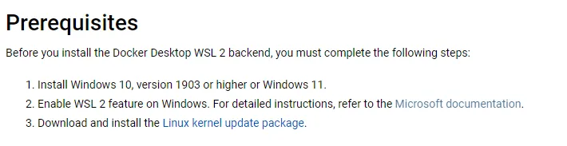
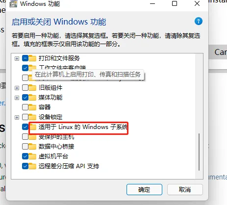
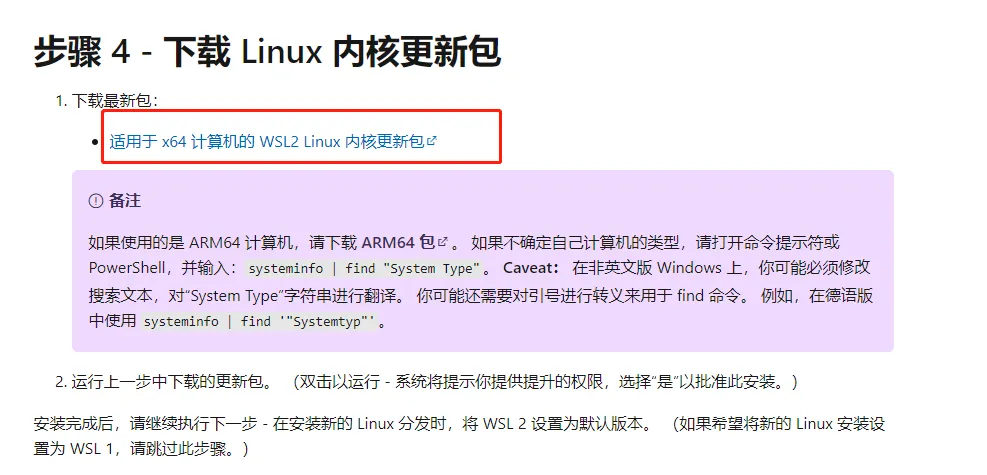

## 官网文档

[Docker](https://docs.docker.com/get-docker/)官网文档

## 安装环境支持

根据不同的环境下载不同的安装包，mac、windows、linux都支持

## 安装 - windows

Docker默认安装再C盘，我们可以做个==软链到C盘==。

`mklink /j "C:\Program Files\Docker" "D:\Program Files\Docker"`

软链接创建后，D盘文件夹需要先创建

## 遇到问题 - windows

安装完后**启动**可能会出现的报错

### **wsl2 启动 Docker 文档查询**

[wsl2](https://docs.docker.com/desktop/windows/wsl/)文档

基于 windows 内的 Linux

### **解决办法**

- 先开windows功能（==系统默认开启==）

- 重启后还是报错的话，==系统版本比较旧，需要更新WSL2==

[微软更新文档](https://learn.microsoft.com/zh-cn/windows/wsl/install-manual)

下载包后安装更新后，再重新启动就可以**启动成功**。

## 设置镜像加速

需要寻找第三方代理镜像，国内大公司的镜像已经不能使用。
