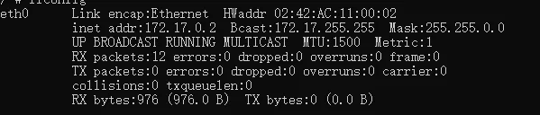
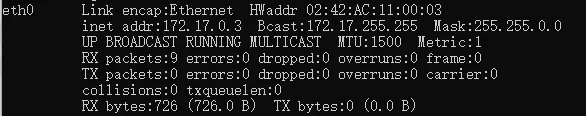
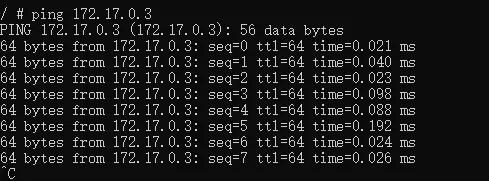
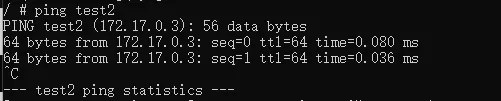
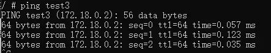
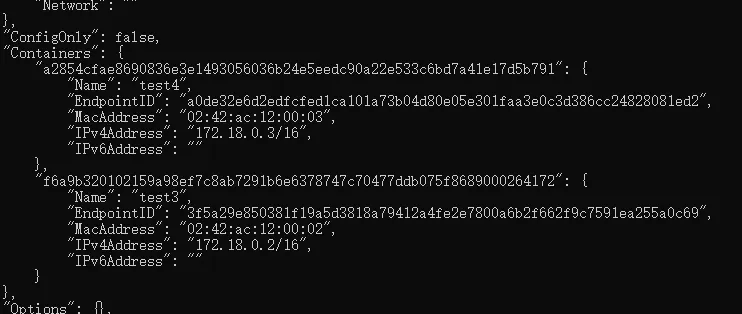

Docker 提供多种网络模式满足不同通信需求，核心解决容器间、容器与宿主机的网络互通问题，以下`按基础操作流程 + 核心网络模式`分类整理，包含命令、实操示例及互通特性说明，基于 `busybox` 轻量镜像演示（无需额外配置，适合网络测试）。

## 基础容器操作命令

### 常规创建容器（默认桥接网络，无互通配置）

默认创建的容器加入 Docker 内置 `bridge` 网络，容器间无法通过`容器名` ping 通，仅可通过容器 IP（如 127.0.0.3）尝试通信：

``` bash
# 创建测试容器test1，后台持续运行
docker run --name test1 -d busybox /bin/sh -c "while true;do echo hello;sleep 10;done"
# 创建测试容器test2，后台持续运行
docker run --name test2 -d busybox /bin/sh -c "while true;do echo hello;sleep 10;done"
```

### 进入容器交互终端

``` bash
# 进入test1容器
docker exec -it test1 /bin/sh
# 进入test2容器
docker exec -it test2 /bin/sh
```

### 实例图

**test1容器**



**test2容器**



**test1 ping test2 IP**



**test ping test2 容器名**


## --link 单向关联容器（传统方式，单向互通）

通过 `--link` 参数将一个容器关联到另一个容器，实现`单向域名解析 + 网络互通`，仅被关联方向可访问关联方，反向不通。

### 实操步骤

1. 保留已创建的 `test2` 容器，删除原 `test1` 容器（需重新创建并添加关联）；
2. 重新创建 `test1` 并通过 `--link` `test2` 关联 test2：

``` bash
# 重新创建test1，--link 关联test2（格式：--link 被关联容器名）
docker run --name test1 -d --link test2 busybox /bin/sh -c "while true;do echo hello;sleep 10;done"
```

### 互通特性

- 进入 `test1` 容器，ping test2 → 可以通（link 实现容器名解析）；



- 进入 `test2` 容器，ping test1 → 不通（单向关联，无反向解析）。


## 自定义 bridge 网络（推荐，双向互通）

Docker 支持手动创建自定义 `bridge` 网络，==加入该网络的所有容器自动实现双向域名解析 + 网络互通==，无需额外配置，是官方推荐的容器间互通方式。

### 创建自定义 bridge 网络

``` bash
# 格式：docker network create -d 网络驱动 网络名
# -d bridge：指定桥接网络驱动，demo为自定义网络名
docker network create -d bridge demo
```

### 创建容器并加入自定义网络

通过 `--network` 网络名 参数，将容器加入已创建的 demo 网络：

``` bash
# 创建test3容器，加入demo网络
docker run --name test3 -d --network demo busybox /bin/sh -c "while true;do echo hello;sleep 10;done"
# 创建test4容器，加入demo网络
docker run --name test4 -d --network demo busybox /bin/sh -c "while true;do echo hello;sleep 10;done"
```

### 容器间双向互通测试

``` bash
# 进入test3容器，ping test4 → 可以通
docker exec -it test3 /bin/sh && ping test4
# 进入test4容器，ping test3 → 可以通
docker exec -it test4 /bin/sh && ping test3
```

- test3 中 ping test4


- test4 中 ping test3



### 查看自定义网络详细信息

可查看网络内的容器列表、IP 地址、网关等核心信息：

``` bash
# 格式：docker network inspect 网络名
docker network inspect demo
```




## host 模式（与宿主机共享网络）

- 特性：容器不创建独立网络空间，==与宿主机使用同一网段、同一 IP==，`容器内端口`直接映射到宿主机，无需额外指定 `-p` 端口映射；
- 适用场景：需要容器与宿主机网络完全互通，追求网络性能（无端口转发开销）；


``` bash
docker run --name test-host -d --network host busybox /bin/sh -c "while true;do echo hello;sleep 10;done"
```

## none 模式（无网络，隔离环境）

- 特性：容器无网卡、无 IP、无网络连接，==完全与外部网络隔离==，仅保留本地回环地址（127.0.0.1）；
- 适用场景：无需网络的离线操作容器、追求极致网络隔离的场景；

``` bash
docker run --name test-none -d --network none busybox /bin/sh -c "while true;do echo hello;sleep 10;done"
```